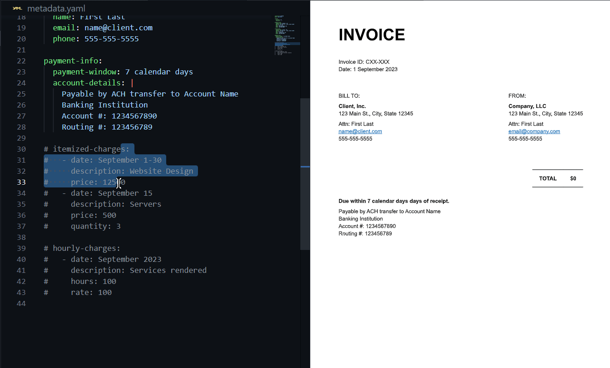

# Invoice Template for Typst

Generates a minimalist invoice from provided company, customer and charges data. One nice upside of this template vs manually configuring an invoice is that totals are automatically calculated, reducing the chance of human error.

All required information can be changed in the sample [metadata.yaml](metadata.yaml) file, and the MWE [main.typ](main.typ) file shows its usage. If you prefer toml or json, these are fine too -- just be sure to change the reader function in your main file.

## Features
### Locale:
Simply change the default `locale` options in your metadata, or update the respective template states before rendering.

### Billing options:
- `itemized-bill`: Non-hourly charges that can optionally leave out a quantity such as milestone deliverables (e.g., "Website design").
  - If any list item specifies a quantity, the price is multiplied appropriately to generate a total.
- `hourly-bill`: Simply multiplies the hourly rate by the number of hours worked to generate a total.
- If both hourly and itemized options are specified, a heading is added to each table of charges to distinguish them.

### Custom styling
Pass `use-default-style: false` to the invoice function to prevent the default font, paper size, and link styling.

## Roadmap
I'm not sure how to best handle taxes, so I'm open to suggestions if this applies to you.